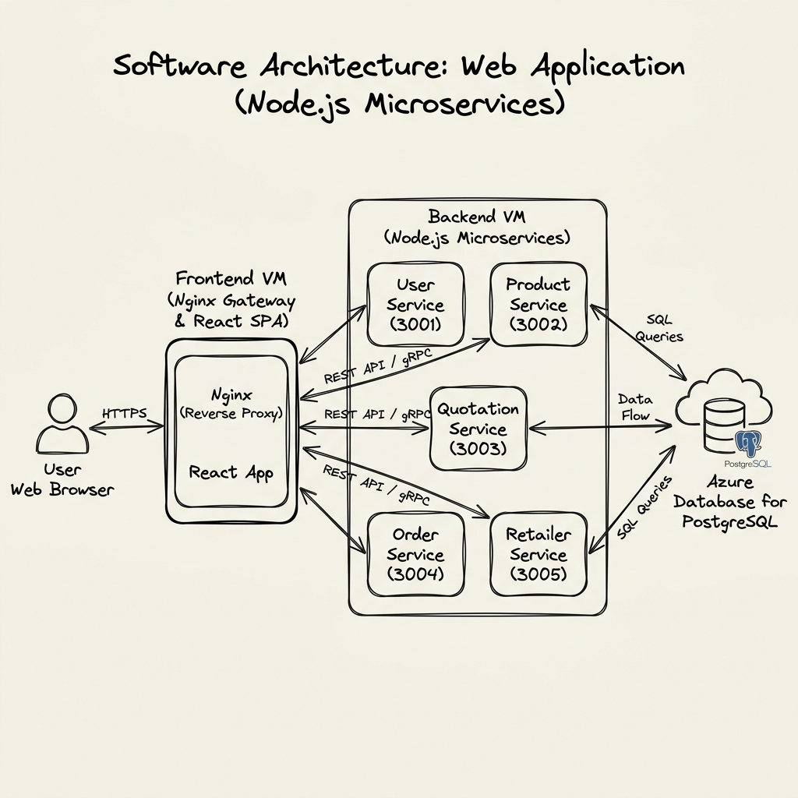

# V K Paints Selection & Ordering Platform

This is a complete end-to-end web application designed with a clean microservices architecture. It consists of a React Frontend and highly optimized Node.js Backend services that are designed to be deployed directly on Virtual Machines (VMs) and connect to Azure Database for PostgreSQL.

## 🏗️ Application Architecture


## Core Microservices
- **User Service**: Authentication and role-based access control (runs on port `3001`).
- **Product Service**: Manages the paint catalog and metadata (runs on port `3002`).
- **Quotation Service**: Stateless service to compute paint requirements and costs (runs on port `3003`).
- **Order Service**: Placements and transaction logs (runs on port `3004`).
- **Retailer Service**: Finds nearby stores using geolocations (runs on port `3005`).
- **Frontend**: React (Vite) single-page application served via Nginx, which also acts as the lightweight reverse proxy and API Gateway.

## Technologies Used
- Node.js & Express
- React (Vite)
- Azure Database for PostgreSQL (Flexible Server)
- Nginx (Web Server and Reverse Proxy Gateway)

---

## Deployment Instructions

All provisioning scripts are located in the `deploy/` directory:

### 1. Backend Virtual Machine Deployment
The backend VM hosts all Node.js microservices. The script will automatically install Node.js 20, create the necessary databases on your Azure PostgreSQL server, URL-encode the credentials to avoid connection string parsing errors, write `.env` config files, and configure `systemd` daemon services for automatic management.

Execute the following command on your Backend VM:
```bash
sudo chmod +x deploy/vm-backend-bootstrap.sh
sudo ./deploy/vm-backend-bootstrap.sh <DB_HOST> <DB_USER> <DB_PASS>
```

**Parameters:**
* `<DB_HOST>`: The FQDN of your Azure Database for PostgreSQL (e.g., `vkpaints-pg-server.postgres.database.azure.com`).
* `<DB_USER>`: Database administrator username (e.g., `vkadmin`).
* `<DB_PASS>`: Database administrator password (e.g., `Admin@123!`).

**Example:**
```bash
sudo ./deploy/vm-backend-bootstrap.sh vkpaints-pg-server.postgres.database.azure.com vkadmin 'Admin@123!'
```

---

### 2. Frontend Virtual Machine Deployment
The frontend VM hosts Nginx, serves the compiled React app, and acts as the API Gateway. The script will install Node.js and Nginx, clone the repository, compile the frontend assets, and set up the Nginx routing rules to proxy API requests to the Backend VM.

Execute the following command on your Frontend VM:
```bash
sudo chmod +x deploy/vm-frontend-bootstrap.sh
sudo ./deploy/vm-frontend-bootstrap.sh <BACKEND_VM_PRIVATE_IP>
```

**Parameters:**
* `<BACKEND_VM_PRIVATE_IP>`: The private IP address of your backend VM (e.g., `10.2.1.4`).

**Example:**
```bash
sudo ./deploy/vm-frontend-bootstrap.sh 10.2.1.4
```

---

## Troubleshooting & Verification

### Checking Backend Service Statuses
To check the statuses of the backend services on the Backend VM:
```bash
# General service status
systemctl status vkpaints-user-service
systemctl status vkpaints-product-service
systemctl status vkpaints-order-service
systemctl status vkpaints-retailer-service
systemctl status vkpaints-quotation-service

# View live application logs
journalctl -u vkpaints-user-service -f
journalctl -u vkpaints-product-service -f
```

### Checking Frontend Nginx Gateway
To check Nginx status or logs on the Frontend VM:
```bash
systemctl status nginx
sudo nginx -t
sudo tail -f /var/log/nginx/error.log
```
